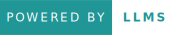

# MediTools 

Meditools is an application designed to provide interactive learning experiences and up-to-date medical information, making it easier for medical professionals and students to enhance their knowledge and skills.

### We currently have 2 tools:
1.  Dermatology Case Simulation Tool
2.  Medical Knowledge Tool
    - AI-Enhanced PubMed: Query and Understand with LLMs
    - Google News Retrieval

# 🌐Links

[Application - meditools.streamlit.app](https://meditools.streamlit.app/)
